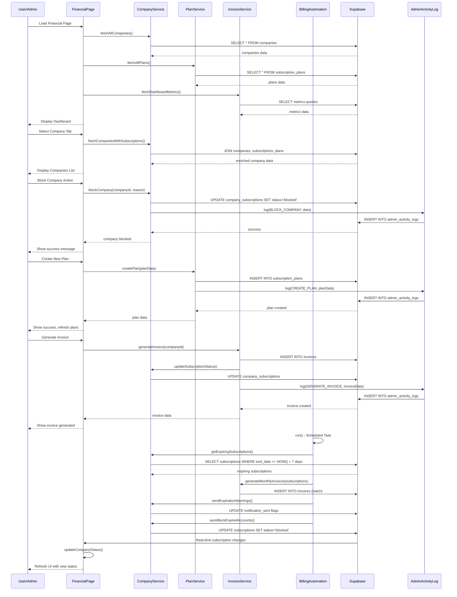

# Financial Management System - System Design

## Implementation approach

We will develop a comprehensive Financial Management screen as an administrative control panel for managing companies, subscription plans, billing, and access control. The system will be built using React with TypeScript, Shadcn-ui components, and Tailwind CSS for styling. We'll use Supabase as the backend for data persistence and real-time updates.

The difficult points of the requirements include:
- **Automated billing system** - Monthly invoice generation and payment tracking
- **Real-time status management** - Company blocking/unblocking with immediate effect
- **Complex relationships** - Companies, plans, subscriptions, and invoices interconnection
- **Administrative controls** - Comprehensive audit trail and permission management

We will select the following open-source frameworks:
- **React Query/TanStack Query** for efficient data fetching and caching
- **React Hook Form** for form management and validation
- **Recharts** for dashboard analytics and visualizations
- **Date-fns** for date manipulation and formatting
- **Zod** for schema validation

## Data structures and interfaces

```mermaid
classDiagram
    class FinancialPage {
        +activeTab: string
        +companies: Company[]
        +plans: SubscriptionPlan[]
        +invoices: Invoice[]
        +metrics: DashboardMetrics
        +__init__()
        +switchTab(tabName: string): void
        +refreshData(): Promise~void~
        +exportData(type: string): void
    }

    class Company {
        +id: string
        +name: string
        +cnpj: string
        +email: string
        +phone: string
        +address: string
        +status: CompanyStatus
        +subscription: CompanySubscription
        +createdAt: Date
        +updatedAt: Date
        +__init__(data: CompanyData)
        +block(reason: string): Promise~void~
        +unblock(): Promise~void~
        +changePlan(planId: string): Promise~void~
        +generateInvoice(): Promise~Invoice~
    }

    class SubscriptionPlan {
        +id: string
        +name: string
        +description: string
        +price: number
        +billingCycle: BillingCycle
        +maxUsers: number
        +maxProducts: number
        +features: PlanFeatures
        +isActive: boolean
        +createdAt: Date
        +__init__(data: PlanData)
        +create(): Promise~SubscriptionPlan~
        +update(data: Partial~PlanData~): Promise~void~
        +delete(): Promise~void~
        +getCompaniesCount(): number
    }

    class CompanySubscription {
        +id: string
        +companyId: string
        +planId: string
        +status: SubscriptionStatus
        +startDate: Date
        +endDate: Date
        +monthlyPrice: number
        +autoRenew: boolean
        +blockedBy: string
        +blockedAt: Date
        +blockReason: string
        +__init__(data: SubscriptionData)
        +activate(): Promise~void~
        +expire(): Promise~void~
        +block(adminId: string, reason: string): Promise~void~
        +unblock(): Promise~void~
        +renew(): Promise~void~
    }

    class Invoice {
        +id: string
        +companyId: string
        +subscriptionId: string
        +invoiceNumber: string
        +amount: number
        +dueDate: Date
        +status: InvoiceStatus
        +paidDate: Date
        +createdAt: Date
        +__init__(data: InvoiceData)
        +generate(): Promise~Invoice~
        +markAsPaid(): Promise~void~
        +markAsOverdue(): Promise~void~
        +cancel(): Promise~void~
        +sendNotification(): Promise~void~
    }

    class DashboardMetrics {
        +totalCompanies: number
        +monthlyRevenue: number
        +activeSubscriptions: number
        +blockedCompanies: number
        +expiringSubscriptions: number
        +overdueInvoices: number
        +planDistribution: PlanDistribution[]
        +revenueChart: RevenueData[]
        +__init__()
        +calculate(): Promise~DashboardMetrics~
        +getRevenueChart(): Promise~RevenueData[]~
        +getPlanDistribution(): Promise~PlanDistribution[]~
    }

    class BillingAutomation {
        +generateMonthlyInvoices(): Promise~void~
        +checkExpiringSubscriptions(): Promise~void~
        +autoBlockExpiredAccounts(): Promise~void~
        +sendExpirationWarnings(days: number): Promise~void~
        +processPaymentConfirmations(): Promise~void~
        +__init__()
        +run(): Promise~void~
    }

    class AdminActivityLog {
        +id: string
        +adminUserId: string
        +companyId: string
        +action: AdminAction
        +entityType: string
        +entityId: string
        +oldValues: object
        +newValues: object
        +reason: string
        +createdAt: Date
        +__init__(data: ActivityData)
        +log(action: AdminAction, data: ActivityData): Promise~void~
        +getHistory(companyId: string): Promise~AdminActivityLog[]~
    }

    %% Relationships
    FinancialPage ||--o{ Company : manages
    FinancialPage ||--o{ SubscriptionPlan : manages
    FinancialPage ||--o{ Invoice : manages
    FinancialPage ||--|| DashboardMetrics : displays
    Company ||--|| CompanySubscription : has
    CompanySubscription }o--|| SubscriptionPlan : references
    Company ||--o{ Invoice : generates
    Invoice }o--|| CompanySubscription : belongs_to
    BillingAutomation ..> Invoice : creates
    BillingAutomation ..> CompanySubscription : monitors
    AdminActivityLog ..> Company : tracks
    AdminActivityLog ..> SubscriptionPlan : tracks
    AdminActivityLog ..> Invoice : tracks

    %% Enums
    class CompanyStatus {
        <<enumeration>>
        ACTIVE
        BLOCKED
        EXPIRED
        CANCELLED
    }

    class SubscriptionStatus {
        <<enumeration>>
        ACTIVE
        EXPIRED
        BLOCKED
        CANCELLED
        PENDING
    }

    class InvoiceStatus {
        <<enumeration>>
        PENDING
        PAID
        OVERDUE
        CANCELLED
    }

    class BillingCycle {
        <<enumeration>>
        MONTHLY
        YEARLY
    }

    class AdminAction {
        <<enumeration>>
        BLOCK_COMPANY
        UNBLOCK_COMPANY
        CHANGE_PLAN
        GENERATE_INVOICE
        CREATE_PLAN
        UPDATE_PLAN
        DELETE_PLAN
    }
```

## Program call flow



## Anything UNCLEAR

The following aspects need clarification:

1. **Payment Integration**: Which payment gateway will be used for processing payments? (PIX, Credit Card, Bank Transfer)

2. **Notification System**: How should notifications be sent to companies? (Email, SMS, In-app notifications)

3. **User Authentication**: How will company users authenticate? Should we create a separate login system for each company?

4. **Data Migration**: How should existing companies be migrated to the new subscription system? Should they get a default plan?

5. **Pricing Strategy**: Should we support different currencies or discount codes for plans?

6. **Backup and Recovery**: What's the strategy for data backup and system recovery?

7. **Performance Requirements**: What's the expected number of companies and concurrent users?

8. **Compliance**: Are there any specific Brazilian regulations (LGPD) that need to be considered for financial data?

9. **Integration Points**: Should this system integrate with existing accounting software or ERP systems?

10. **Mobile Access**: Should company users have mobile access to view their subscription status and invoices?