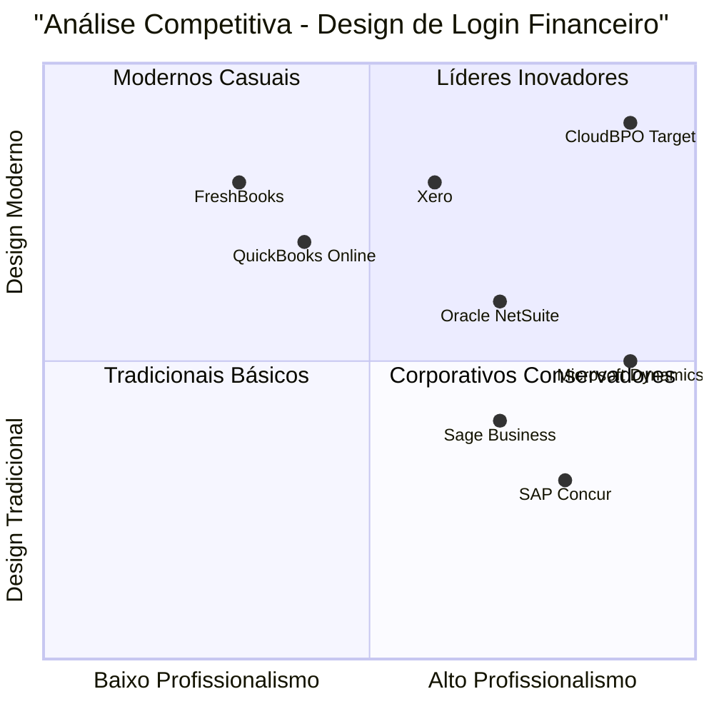

# PRD - Login Page Visual Redesign
## CloudBPO Financial Management System

### 1. Language & Project Info
- **Language**: Portuguese (Brazil)
- **Programming Language**: React, TypeScript, Tailwind CSS
- **Project Name**: cloudbpo_login_redesign
- **Original Requirements**: Redesenhar a tela de login com visual moderno e profissional, incluindo imagem de fundo business, sem alterar funcionalidades de autenticação

### 2. Product Definition

#### Product Goals
1. **Modernizar a Interface**: Criar um design de login contemporâneo e profissional que reflita a qualidade dos serviços BPO financeiros
2. **Transmitir Confiança**: Utilizar elementos visuais que comuniquem segurança, profissionalismo e expertise no setor financeiro
3. **Manter Usabilidade**: Preservar toda funcionalidade existente enquanto melhora significativamente a experiência visual

#### User Stories
1. **Como usuário empresarial**, quero ver uma tela de login que transmita profissionalismo e confiança, para que eu me sinta seguro ao acessar o sistema financeiro
2. **Como administrador de TI**, quero que a tela de login seja moderna e alinhada com padrões corporativos, para que represente adequadamente nossa empresa
3. **Como gestor financeiro**, quero uma interface que reflita a seriedade dos serviços BPO, para que clientes tenham confiança no sistema
4. **Como usuário mobile**, quero que o design seja responsivo e profissional em qualquer dispositivo, para acessar o sistema com qualidade visual
5. **Como stakeholder**, quero que a marca CloudBPO seja representada com excelência visual, para fortalecer nossa imagem no mercado

#### Competitive Analysis

**1. SAP Concur**
- **Pros**: Design limpo, cores corporativas, imagem de fundo sutil
- **Cons**: Interface muito conservadora, pouco dinamismo visual

**2. Oracle NetSuite**
- **Pros**: Layout moderno, boa hierarquia visual, branding forte
- **Cons**: Complexidade visual excessiva, muitos elementos

**3. QuickBooks Online**
- **Pros**: Interface amigável, cores vibrantes, boa usabilidade
- **Cons**: Muito casual para ambiente BPO corporativo

**4. Xero**
- **Pros**: Design contemporâneo, excelente responsividade
- **Cons**: Falta elementos que transmitam robustez empresarial

**5. Microsoft Dynamics 365**
- **Pros**: Visual profissional, integração de marca, design consistente
- **Cons**: Interface pode parecer genérica

**6. Sage Business Cloud**
- **Pros**: Equilibrio entre moderno e profissional, boa tipografia
- **Cons**: Cores muito neutras, falta personalidade

**7. FreshBooks**
- **Pros**: Interface moderna, boa experiência do usuário
- **Cons**: Muito focado em pequenas empresas, não transmite robustez BPO

#### Competitive Quadrant Chart



### 3. Technical Specifications

#### Requirements Analysis
O redesign da tela de login deve focar exclusivamente em melhorias visuais, mantendo toda a funcionalidade de autenticação intacta. É necessário implementar um design que combine modernidade com profissionalismo corporativo, utilizando imagens de fundo relacionadas ao setor financeiro/BPO.

#### Requirements Pool

**P0 (Must-have)**
- Implementar imagem de fundo profissional relacionada ao setor financeiro/BPO
- Remover credenciais demo conforme solicitado
- Atualizar copyright de 2024 para 2025
- Manter toda funcionalidade de login existente
- Garantir responsividade em todos os dispositivos
- Aplicar overlay adequado para legibilidade do formulário

**P1 (Should-have)**
- Implementar animações sutis e modernas
- Melhorar hierarquia visual e tipografia
- Adicionar elementos visuais que transmitam confiança
- Otimizar contraste e acessibilidade
- Implementar loading states mais elegantes

**P2 (Nice-to-have)**
- Adicionar micro-interações no formulário
- Implementar tema escuro opcional
- Adicionar efeitos de parallax sutis
- Incluir indicadores de força de senha visuais

#### UI Design Draft

**Layout Principal:**
```
┌─────────────────────────────────────┐
│ [Imagem de Fundo Business/Financial] │
│ ┌─────────────────────────────────┐ │
│ │        [Overlay Escuro]         │ │
│ │  ┌─────────────────────────┐    │ │
│ │  │     Logo CloudBPO       │    │ │
│ │  │   "BPO Financeiro"      │    │ │
│ │  └─────────────────────────┘    │ │
│ │                                 │ │
│ │  ┌─────────────────────────┐    │ │
│ │  │    Card de Login        │    │ │
│ │  │  ┌─────────────────┐    │    │ │
│ │  │  │ Campo Email     │    │    │ │
│ │  │  │ Campo Senha     │    │    │ │
│ │  │  │ Botão Entrar    │    │    │ │
│ │  │  └─────────────────┘    │    │ │
│ │  └─────────────────────────┘    │ │
│ │                                 │ │
│ │     © 2025 CloudBPO            │ │
│ └─────────────────────────────────┘ │
└─────────────────────────────────────┘
```

**Elementos Visuais:**
- Imagem de fundo: Escritório moderno com elementos financeiros
- Overlay: Gradiente escuro para garantir legibilidade
- Card: Vidro fosco com bordas sutis
- Cores: Azul corporativo (#1e40af) com acentos dourados
- Tipografia: Inter/System fonts para modernidade

#### Open Questions
1. Qual estilo de imagem de fundo seria mais apropriado: escritório corporativo, gráficos financeiros, ou skyline urbano?
2. Devemos incluir animações de entrada para os elementos do formulário?
3. É necessário implementar modo escuro desde o início ou pode ser uma iteração futura?
4. Qual nível de transparência seria ideal para o card de login?

### 4. Implementation Guidelines

#### Design Principles
- **Profissionalismo**: Cada elemento deve transmitir seriedade e competência
- **Modernidade**: Utilizar tendências atuais sem comprometer usabilidade
- **Simplicidade**: Interface limpa focada na tarefa principal
- **Confiabilidade**: Visual que inspire segurança e estabilidade

#### Technical Constraints
- Manter compatibilidade com React 18+
- Utilizar apenas Tailwind CSS para estilização
- Preservar toda lógica de autenticação existente
- Garantir performance otimizada para carregamento de imagens
- Manter acessibilidade WCAG 2.1 AA

#### Success Metrics
- Redução do tempo de hesitação antes do login
- Feedback positivo sobre profissionalismo da interface
- Manutenção da taxa de conversão de login
- Zero regressões em funcionalidade
- Melhoria na percepção da marca CloudBPO

### 5. Next Steps
1. **Fase 1**: Implementação do novo design visual
2. **Fase 2**: Testes de usabilidade e ajustes
3. **Fase 3**: Otimizações de performance
4. **Fase 4**: Documentação e handoff

---

**Aprovação**: Aguardando validação do design proposto antes da implementação técnica.